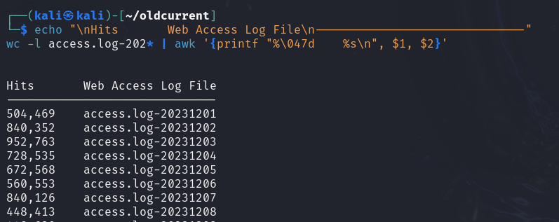
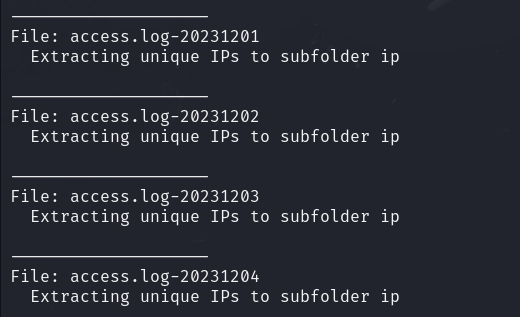
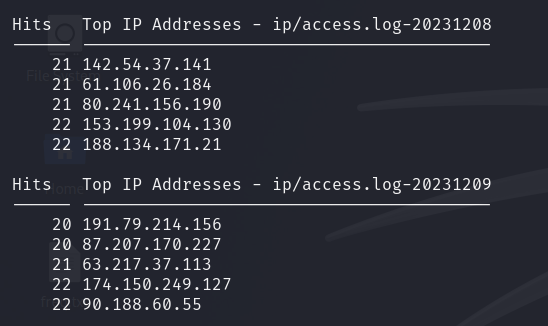
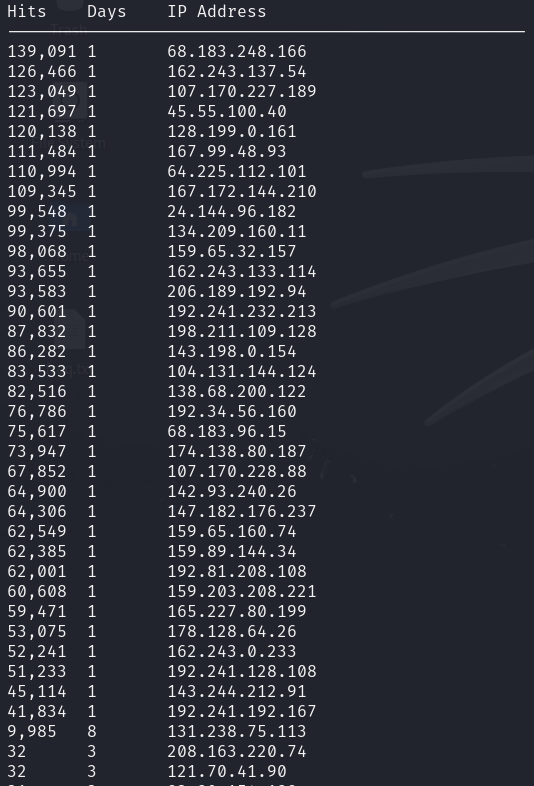
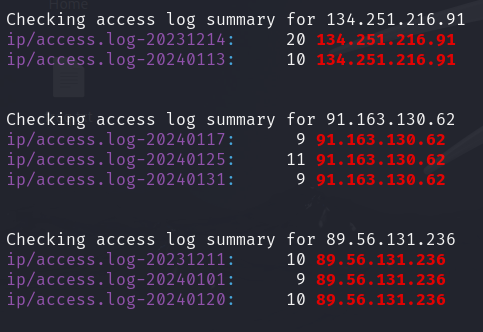
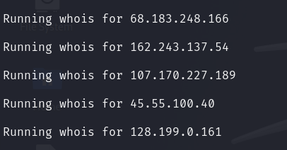
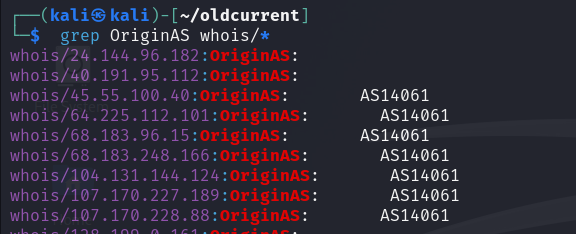

# Summary Table Of Fields


| Field | Field Name          | Description                                   | Example
|-------|---------------------|-----------------------------------------------| --------------|
| 1     | IP Address	      | IP initiating the request | 132.239.248.220  |
| 2     | Identity            | Usually a dash "-" (rarely used) | - |
| 3     | Authenticated User  | Username if the request required authentication | - |
| 4     | Timestamp           | Date and time of the request (timezone separate) | [18/Jan/2024:00:00:09  |
| 5     | Timezone            | Timezone                           | -0500]  |
| 6     | Request Line        | The HTTP method, URL, and protocol version. | "GET /logo.jpg HTTP/1.1" |
| 7     | HTTP Status Code    | The server’s response code (e.g., 200, 404, 500). | 200 |
| 8     | Bytes Sent          | Size of the response in bytes. |  513 | 
| 9     | Referer             | The URL that referred the request (if any). |  "http://www.mygiftcard.com/" |
| 10    | User Agent          | Client browser, OS, or tool details. | "Mozilla/5.0 (Macintosh; Intel..." |

* Note 1: Timestamp is usually a single field with a space between the datetime and timezone fields, but for simplicity we are treating it as two separate fields
* Note 2: Yes, the Referer field really is misspelled. That there missspeling hass ben widly adopteed buy thee industree.
* Note 3: The cut command in Linux cannot natively treat quoted fields as a single field if they contain delimiters, so we will use awk.
  

### Example Line
```
24.157.54.120 - - [01/Jan/2024:01:01:23 -0500] "GET /icons/image2.gif HTTP/1.1" 200 513 "http://www.mygiftcard.com/" "Mozilla/5.0 (Macintosh; Intel Mac OS X 10_15_7) AppleWebKit/605.1.15 (KHTML, like Gecko) Version/15.6.1 Safari/605.1.15"
```

### Field Mapping
| 1 - IP Address | 2 - Identity | 3 - Authenticated User | 4 - Timestamp         | 5 - Timezone | 6 - Request Line                 | 7 - HTTP Status Code | 8 - Bytes Sent | 9 - Referrer                  | 10 - User-Agent                                                                                                           |
|----------------|--------------|------------------------|-----------------------|--------------|----------------------------------|----------------------|----------------|-------------------------------|---------------------------------------------------------------------------------------------------------------------------|
| 24.157.54.120  | -            | -                      | [01/Jan/2024:01:01:23 | -0500]       | "GET /icons/image2.gif HTTP/1.1" | 200                  | 513            | "http://www.mygiftcard.com/"  | "Mozilla/5.0 (Macintosh...." |


#
---
# Questions to ask of the raw web access logs

#### 1. What was the number of website hits per day?
```
echo "\nHits       Web Access Log File\n------------------------------"
wc -l access.log-202* | awk '{printf "%\047d    %s\n", $1, $2}'
```



#
#### 2. What are the top 5 IP addresses per day?
```
for i in `ls access.log-202*`
do
echo "\n Hits   Top IP Addresses - ${i}\n ------ -----------------------------------------"
awk '{print $1}' $i | sort | uniq -c | sort -rn | head -5
done
```


---
# Preprocessing large collections into groups

The access logs span 62 days totalling 10GB meaning that grep and other text-based tools are likely to run slow.
Lets place unique values by day for each of these fields for later querying.
    1. IPs (ip)
    2. Request Line (request)
    3. HTTP Status Codes (status)


For each of the access logs, extract the unique value counts. 
This will take several minutes initially but will speed up subsequent searches for these fields.
```
# From the folder holding the access logs, create 4 subfolders 
mkdir ip request status 

# Loop through each of the access logs summarizing the counts into files located in the subfolder
for i in `ls access.log-202*`
do
echo "\n--------------------\nFile: $i"

echo "  Extracting unique IPs to subfolder ip"
cat $i | cut -f 1 -d ' ' | sort | uniq -c | sort -n > ip/${i}

# Request Line - Remove following 2 columns to enable
# echo "  Extracting unique requests to subfolder request"
# cat $i | cut -f 6 -d ' ' | sort | uniq -c | sort -n > request/${i}

# HTTP Status Code - Remove following 2 columns to enable
# echo "  Extracting unique status codes to subfolder status"
# cat $i | cut -f 7 -d ' ' | sort | uniq -c | sort -n > status/${i}

done
```



#
#### 1. Using the grouped data in the 'ip' subfolder, how many total hits were recorded by day?
```
echo "\nLog File               Total Hits \n---------------------- ----------------------------"
for i in `ls ip/access.log-202*`
do
totalhits=$(awk '{sum += $1} END {printf "%\047d", sum}' $i)
echo $i $totalhits 
done

# Total hits over all days
echo "\nTotal Hits\n------------------------"
cat ip/access.log-202* | awk '{total += $1 } END {printf "%\047d \n", total}'
```


#
#### 2. What are the top 5 IP addresses per day?
```
# Top IP addresses by day. Grouped data is already sorted in ascending order.
for i in `ls ip/access.log-202*`
do
echo "\n Hits   Top IP Addresses - ${i}\n ------ -----------------------------------------"
tail -5 $i
done
```

#
#### 3. How many unique IP addresses connected over the 62 days
```
# The grouped logs have two columns with format of [Count] [Distinct IP]
# Grab the IP address only ($2) from all grouped access logs and count distinct IPs
cat ip/access.log-202* | awk '{print $2}' | sort | uniq -c | wc -l | awk '{printf "%\047d \n", $1}'
```


#
#### 4. Over all 62 days, which IPs show up most often?
```
# Each raw web access log has 500k-1M entries with ~50k distinct IPs in each log
# Over 62 days, 4.42 million IPs connected to the site 
echo "Hits\tDays\tIP Address\n----------------------------------------------------" > top50ips
cat ip/access.log-202* | awk '{count[$2] += $1; days[$2] += 1} END {for (ip in count) {printf "%\047d\t%s\t%s\n", count[ip], days[ip], ip}}' | sort -nr | head -50 | tee -a top50ips
cat top50ips
```


#
#### 5. For the most common IP addresses, on which days did they appear in the logs?
```
# This line skips the first rows of the file and starts reading from row #3:  "tail -n +3 top50ips" 
for ip in `tail -n +3 top50ips | awk '{print $3}'`
do
echo "\n\nChecking access log summary for $ip"
grep $ip ip/access*
done
```



#### 6. What is the 'whois' output from each of the top IPs?
```
# Create a new subfolder named whois and write the output of 'whois' for each IP
mkdir whois

# This line skips the first rows of the file and starts reading from row #3:  "tail -n +3 top50ips" 
for ip in `tail -n +3 top50ips | awk '{print $3}'`
do
echo "\nRunning whois for $ip"
whois $ip > whois/$ip
done

ls -l whois
```



#
#### 7. What is the ASN of those top IP addresses?
```
grep OriginAS whois/*
```



